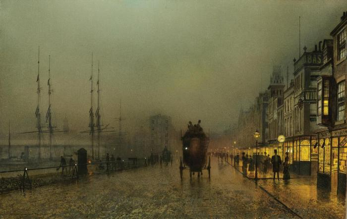

# Glasgow to Inverkip (Wednesday 1st March 2017) #

My train inches out of Glasgow Central station and across the Clyde. It is golden hour, that time when the sun is near the horizon, beloved of photographers because of its richness. Though there are some clouds, the day is as bright and welcoming as all the interactions that I have had with people since rolling off the overnight sleeper coach at Buchanan St bus station. The train gathers speed through an industrial area, diving into a cutting. We emerge to local authority housing on one side with industry framed by distant mountains on the other.

We stop at Hilington West. Though I took this train less than three weeks ago, I have no memory of this part of the journey. Presumably I was preoccupied with the decision that I was about to make. It had been my daughter Maxime’s birthday, exactly 26 years since I had jumped for joy in the doorway of 27 Watermead House and whacked my head pretty hard. Though on that day in February I would end up celebrating with Max in Glasgow, her birthday wasn’t the reason for my visit.

The train pulls into Paisley Gilmore Street and I reflect on how the dark stone of the Victorian buildings has become much warmer to me since I first started visiting this part of the world. Today’s journey is a consequence of the decision I was coming to on Maxime’s birthday.

Some aspects of attraction are about how things look at rest. For me the moving component had always been more important. I had seen images of her, I’d even been to see her in person, but it was when we danced across the Clyde on my daughter’s birthday that, in the words of [Sapsorrow](https://en.wikipedia.org/wiki/The_Storyteller_(TV_series)#Sapsorrow), “my head hurt and my tummy ached and my skin tingled and my heart did little somersaults”. I left her that day and returned to party with Maxime, her friends and my two other daughters; Jessica and Tegan, eventually bedding down on the sleeper bus back to London with a beautiful confusion in my heart. By Monday my mind was made up. I was going to spend significantly more time with her. This train journey is the start of that relationship.

At Port Glasgow the docks and cranes lay idle. I’m later told by a taxi driver that things won’t start to pick up until the cruise ships arrive later in the year. The distant hills are still capped in snow. The clouds seem to have mostly gone.

School children join the otherwise empty train at Whinhill so I move my bags to make space for them. As golden hour fades, the day gets brighter and my mood soars. I am temporarily distracted by my phone. When I lift my head again and see, what I remember from before as the drab public sector homes of Branchton, glowing in the sunshine. The sun though, can do nothing for the derelict commercial buildings at IBM Holt. These remain as sad as I remember. The train crosses a gorge with a stream and we emerge from the trees to Inverkip where private sector housing seems to dominate. The station has only one platform indicating that we are only one stop away from the end of the line. I gather my bags together, leave the train and set myself up for a walk down the hill and the beginning of my new life with Kite.

