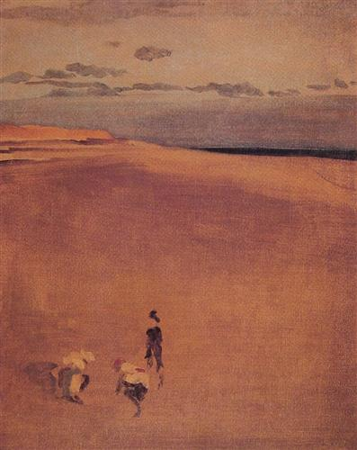

# Chichester to Brighton 
Monday 10th July 2017

I am indeed very fortunate. One of those pieces of fortune is to have outside speakers on my boat so that I can play tunes while I sail along. As I leave Chichester harbour mouth the playlist chooses Ludovico Einaudi’s Primavera and I have a moment of perfect bliss.

I head Kite due south until I am sure that we are clear of obstructions then turn south east. With the wind from the south west coming over the side of the boat we are on the point of sail called a beam reach. I unfurl the fore sail and our speed increases to 8 knots. With the sea empty in front of me I head down to the galley to make some lunch.

Cooking on a boat is interesting. The stove on Kite is gimballed so that it can remain upright while the boat heels from side to side. On rougher seas, where one can’t stand in a cabin without holding on, much care and thought goes into thinking about how to perform what would be the most simple action in a normal kitchen. Today I have opted for the easy option of some tinned soup and a heated baguette. As I’m single handed, cooking even this simple meal requires regular trips back to the cockpit to check on our surroundings. Eventually it is all done and I sit down to eat. My soup is served in a large mug as a bowl would just not be practical with meter high waves.

I have only just finished my lunch when I spy Boulder and Street in the distance. These two buoys mark a safe passage around Selsey Bill. Lunch things are thrown into the sink and I get ready to change course. As we pass Street I turn Kite to the north east, roll away the fore sail and ease off the main sheet and let the waves lick Kite’s stern all the way to Brighton. The wind is behind us now. This point of sail is called a run and is often really comfortable. This is the case now even though there are two meter waves round the Bill. The playlist joins in the fun with some George Michael:

> *All we have to see  
> Is that I don’t belong to you
> And you don't belong to me  
> Freedom  
> Freedom  
> Freedom*  

I can’t help but sing along.

It is at least four hours to Brighton and Kite has work that needs doing so I grab my butane rope sealer and set about replacing the fender lines. Work is slow as I have to keep looking up to check for other vessels and lobster pots.

As I finish and put away the last fender I glimpse the big new wind farm that is being constructed off Brighton as if announcing the town’s green credentials. The sun is directly behind the boat now making it almost impossible to look to the stern because of the brightness. This is good as I really need to concentrate on where I’m going, not just for this voyage but also my greater journey and indeed my life as a whole.
