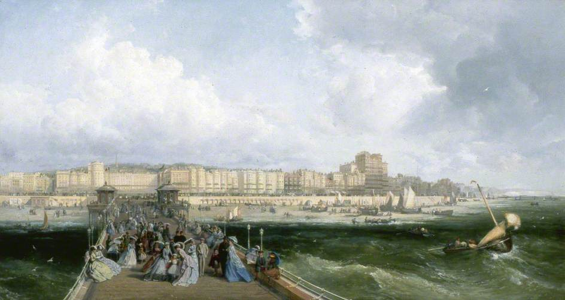

# Brighton to Dartmouth (Friday 21st to Saturday 22nd July 2017)

I rise early as we need to catch the tide. My crew rocks up at 6am while I’m still preparing the boat. She drops her bag and heads off in search of some coffee, leaving me to my work. I watch her small frame walk away and reflect upon how fond of her I have grown. Elle (not her real name) is a relatively new friend, occasional lover and a much more experienced sailor than me. This voyage is bittersweet as, although we will spend the next three days together, it may well be the last time we see each other.

Already running slightly late, we head to the fuel pontoon and fill up Kite. After a quick visit to the chandlers to pick up my newly serviced life jackets and buy an extra safety line we head off. Constrained by time I have convinced a skeptical Elle to leave on Friday even though this means we will have to sail through some difficult weather. South of the Isle of Wight, the wind off St Catherine’s Point is expected to be 30 knots. Rain is also forecast throughout the night. As we leave Brighton though, the sun is shining with the wind at about half its maximum expected speed. We hoist the main fully reefed, leaving out the minimum possible amount of the sail, so that we are not overpowered by the wind later. Even so, with the jib out we are making around 7 knots an hour, which is good going, especially as the sea is definitely not flat calm.

The first part of the passage passes smoothly if with a certain degree of bounce. I cook pasta for lunch and the crew washes up. We have encountered one small problem, the autopilot seems not to be functioning. I assume it’s due to the rough weather and that it will be fine later, after the storm at St Catherine’s Point. I don’t find out till I’m safely in Dartmouth that a fuse has blown. Elle seems happy at the helm so I let her to it and spend my time either cuddling with her while she steers or resting under the spray hood that protects the cockpit from the worst of the waves and the weather. I’m sure that I will get my turn later on.

As we approach the southern side of the Isle of Wight we are met by a bank of cloud and the pressure starts to drop indicating the coming storm. The winds increase and the waves get bigger and we roll away the jib to reduce the power of the sails. As the rain starts we don our wet weather gear and start using the engine to drive us through. Elle is still doing most of the helming and I let her, again resting under the sprayhood. This part of the voyage is not fun, but we make it through what we think is the worst of the storm.

After a couple of hours the winds start to drop and Kite starts to slow. To increase speed we once again unfurl the jib and we are soon moving along nicely. After maybe an hour, at around 9pm, the wind starts to rise again. This may just be a squall, but it’s hard to see with the darkening skies, another possibility is that the storm isn’t over. The wind speed continues to increase, it hits 25 knots and Kite is beginning to heel more than I would like. We take the decision to furl in the jib. We turn head to wind but as we pull on the furling line, the jib sheet flies free and snags on the guardrail. The manically flapping jib becomes a source of intense energy and vibrates the steel of the steel cable like a guitar string. Elle clips on a safety line and heads forward to free the sheet but it is snagged too tightly. We swap safeties so that I can have a go. I head forward armed with my knife on the lanyard in my pocket in case the worst comes to the worst.

As I get to the front of the boat the guardrail guitar has reached heavy metal proportions. I try to free the snag but it’s definitely not budging. I balance myself to cut the line. Leaning back on the coach roof with my feet against the side of the boat, I pull my knife from my pocket. The sheet for the self tacking jib works on a pulley system so there four options of lines to cut. The two lines that lead from the jib to the snag on the guard rail are a blur, I can’t see how to grab them so I opt for the two lines leading down to the jib sheet car. As I cut the first line I briefly reflect on the similarities with bomb disposal. The first cut makes no difference, so I cut the second line and soon realise that I should probably stay away from rendering ordinance safe as a chosen career. The jib pulls the remains of the sheet along the guardrail ripping a stanchion from the deck.

I now have to cut the other lines. These are moving with enough force to snap the 12mm steel stud that held the stanchion. What is more I have to do this at the side of the boat with a largely useless guard rail with a risk of being pitched into the sea. If this happens, I don’t fancy my chances of getting back on the boat. Even though I have a safety line on, it may also snag on the remains of the guard rail making it impossible to return to the stern. I inch along to where the last two lines are flapping wildly. I’m almost horizontal with my feet firmly against the side of the boat. I reach up and plunge my hand into the blur. In my mind the pain is counterbalanced by the joyous feel of a line in my hand. I have never used a knife so quickly. The sheet flies free, through the pulley and the jib flaps relatively harmlessly. By the time I return to the cockpit Elle has the sail furled.

I inspect my hand, which is blistered and bruised. I look up and see the jib, with no sheet to hold it, it is unfurling in the wind. The furling line is all pulled out so I head head below for a sail tie to keep it in place. As I reemerge into the cockpit, Elle takes one look at my hand and grabs the tie from me, clips on, and heads forward, leaving me at the helm steering the boat parallel to the waves.

The time cutting the lines seems to have passed in seconds but was probably at least fifteen minutes. Now, as I watch the diminutive figure of of my crew standing, on the tip of her toes, at the bow of the boat, as it rides up and down the waves, as she tries to attach the sail tie, I would swear we are near the event horizon of a black hole. I can do nothing to help, except hold the boat steady as time crawls along. At one point, as Elle is at maximum stretch, she nearly pitches into the sea, but thankfully manages to hang on. She finishes her task, and with the jib well and truly tied to the forestay, she heads back. I glimpse the controls. The wind has dropped to 19 knots. It was just a squall which we could probably have ridden out.

We catch our breath and the discussion turns to what to do next. Elle favours seeking a safe haven. This would either be the harbours at Poole or Weymouth, probably picking up a mooring or an anchorage at Swanage. I favour pressing on into the calming weather. I rule out Poole, as I don’t fancy the navigation through the harbour and the crew grudgingly agrees to sail for an hour to the next waypoint leaving Swanage or Weymouth as an option.

In the rain, we take the helm for half an hour each. I try the auto helm again but still with no joy. During night sailing, part of the crew takes a turn on watch while others sleep. With an autohelm the watch can be taken comfortably under the spray hood away from the elements, but without it one of us will always need to be exposed, steering the boat.

While Elle helms I work through our options in my head. I try to focus on just the safety factors. A stop would mean we had less time together in Dartmouth, but that is irrelevant. For either Swanage or Weymouth we would have at least three hours sail through most of the night and while it was still dark we would have to drop an anchor or pick a mooring buoy, acts, which, with a tired crew, could easily be as dangerous as continuing. I think about what I would do if I were solo, almost certainly make a large pot of coffee and sail through the night. I contrast that with seeking safe haven with a single tired crew member. I still consider pressing on to be the right option.

I feel clear in my head as I take the helm for the final half hour to the waypoint. As we near I begin our discussion with trepidation. The crew’s view hasn’t changed so as skipper I make the call. Even though she is much more silent than usual, Elle, though not happy, takes it well.

We organise watches. I take the first, then Elle helms while I sleep. I waken to dawn and calmer seas. With most of the weather behind us the rest of the sail passes easily, although we motor all the way. There are even more cuddles at the helm, our disagreement from the night before seemingly forgotten. On arrival at Dartmouth I’m concerned about rafting up against another boat, something I haven’t done before with Kite, but as we arrive two of the marina staff are there to help and we are soon tied up. We shower, eat and curl up under the duvet in main cabin falling asleep till evening.
