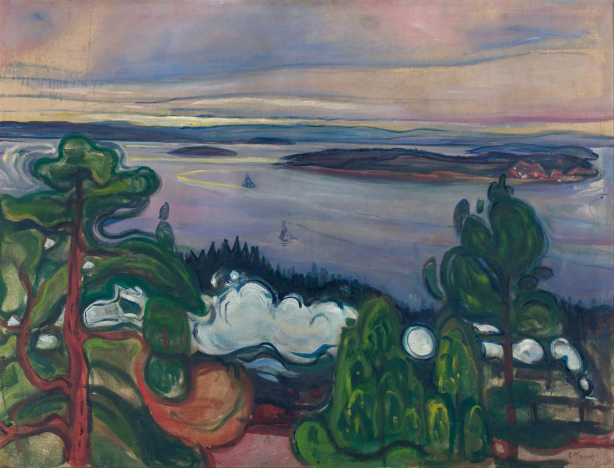

# Tears (Saturday 22nd and Sunday 23rd July 2017)

Elle and I wake from our slumbers in early evening refreshed but hungry. We agree to set off to find some food. Noss on Dart Marina is on the other side of the river a mile or so north of Dartmouth itself. We stop at the facilities and while I wait for Elle, I get talking to Rudgey, a singer and harmonica player, who has a boat in the boatyard.

Noss marina is beautiful if somewhat rundown. It has recently been purchased by the Premier Marina chain who have big plans for the place. While acknowledging that something needs to be done, Rudgey is not keen on all the proposed changes. He says that increases in fees have already driven away some berth holders. He believes proposals for new housing, currently on hold, will be priced far beyond the reach of local people and end up as holiday homes. Elle returns and we ask directions to the higher ferry that we must take to get to Dartmouth. He directs us to a path that goes through the very woodland that may soon become homes. We say our goodbyes and Rudgey climbs into his car, but then he winds down the window and says that he’s going that way and offers us a lift. We jump in and are soon at the ferry landing. Our chauffeur then turns his car round and heads off in the other direction.

Disembarking from the ferry we wander into town. Realising that it is already getting late, after a quick look at the menu, we dive into the Royal Castle Hotel. It is a warren of a place and I’m not quite sure where to go. I ask at a bar and they tell us we can eat there. We sit at a beautiful yew table and eat steaks washed down with cocktails and prosecco. Tired once again, we extravagantly take a river taxi from the quay opposite the hotel right back to the marina and are dropped off yards from Kite. Once again curled up we fall into a deep sleep.

On waking we laze in bed until hunger gets the better of us. This time we do take the path to the upper ferry, and although it’s beautiful, it is also quite tiring, I mentally thank Rudgey for his kindness the night before. As we pass the Royal Castle we see that they do breakfast. We order with a minute to spare thanks to the kind and quick witted barmaid and are soon sitting at the same yew table enjoying egg, bacon and sausage, again accompanied by a bottle of prosecco.

The rest of our day together passes quickly. There are ice creams and coffees as we look at the shops. We take the lower ferry over to Kingswear, check the times of the trains to Paignton and buy tickets. We have two hours to spare so we visit the chandlers. I buy some bits for the guard rail and check out what is available to replace the jib sheet. On the way back to the station we even have time for a quick beer in the Steam Packet Inn.

The train from Kingswear to Paignton is an old fashioned steam, or as Elle prefers to call it, choo choo train. Again I’m transported back in time to a Britain of times gone by. We walk down the named carriages in Pullman colours looking for a space. We find one in Anna and settle down cuddling enjoying the pleasant ride through the English Riviera; knowing, however, that our time together will soon come to an end.

At Paignton we cross from the private steam train line originally separated from the main network by the infamous Beeching in the 1960s. I stand on the platform and watch Elle as her train slowly moves from the station. I cross back to the steam line and settle back down in Anna for the journey back to Dartmouth. As I look out of the window I reflect on our goodbye.

A memory comes back to me. I am sitting in a field behind a Marquee hiding from the main festival. Next to me, listening, is one of my best friends. On her arm, tattooed in Hebrew are the words “This Too Shall Pass”, but right now that doesn’t seem possible. I am in floods of tears. I am like a small child trying to talk through the sobs. These tears though are not caused by an injury or in reaction to a sibling’s unkindness. They are as a flood that results from a tide breaking through a dam. The tide has been the growing understanding that a relationship is failing. The dam bursting is the end of that relationship the day before. I just can’t do that again.

