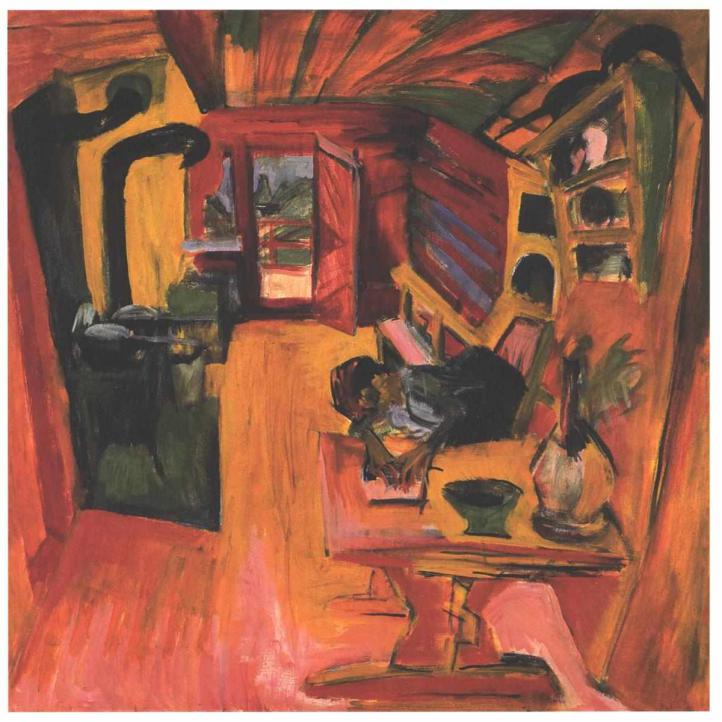

# Linksbohrer and Kitchen 
Wednesday 26th July to Saturday 29th July 2017

There was a time that I would have considered a metal stud, snapped off, so that it is flush with the surface from which it used to protrude, as something impossible to remove. That was before the days of google and youtube. The first time I broke a stanchion, internet searches introduced me to stud removal kits. These consist of reverse threaded screws that are inserted into a hole drilled into the stud and then turned ever so carefully. The problem is drilling the hole. Normal right handed drill bits work clockwise and potentially might drive the stud further into the surface. Hence linksbohrer, or left handed drill bits to you. As one might guess, mine came from Germany, delivered a few days after ordering. How much the internet has empowered us if we only care to look.

Wednesday is forecast to be the only non raining day I will spend in Falmouth. I use my left handed drill bits and stud removal tool to extract the old stanchion stud. I tape over the hole to keep it dry and when the new stanchion and stud arrive on Thursday I fit them, in a gap between the downpours, without a problem. Thanks also to youtube, I make my first attempt at repairing Kites gelcoat covering that was damaged when the stanchion broke free. The results are mixed but I put this down to the terrible weather and not having scales to accurately measure the hardener. I order scales, but for once the internet lets me down and they are not delivered before we leave Falmouth.

On Friday my daughter Maxime arrives. She will be with me for two weeks and will crew Kite from the UK to Portugal. She meets me in the Kitchen. This eating and drinking establishment is run by one of her old friends from Stoke Newington School, Rory, and his business partner Ben. I arrive first and sit quietly and unobtrusively by a window. I clock Rory before he sees me. The boy I remember has grown into a very attractive man, tall and confident in his restaurant venture.

Maxime turns up after a long journey from London which had to be completed in a cab because of a tree fall across the line from Truro to Falmouth. Rory recognises her immediately and by association me. Hugs are exchanged and we settle down to eat. We dine on small tapas like plates which include amongst other things rabbit and wood pigeon. We drink ridiculously expensive Cornish sparkling wine which we justify by the excellence of the food.

As the night proceeds, the place lives up to it's name. It becomes a kitchen. Maxime and I are soon talking to the family at the next table whose daughter is very cute. I engage the father in a conversation about “Too Big to Fail” which moves on, as he is Israeli, to an extended discussion of the West Bank and Gaza. All of this is conducted in the spirit of a warm and generous family, at home and confident in their own kitchen. As the night draws to a close, with most of the restaurant work done, we get to spend some time with Rory and Ben. I may be getting quite drunk by this point and I may knock over and break more than one glass. Maxime calls a cab and, after a little resistance from me, takes me back to the boat.

The next day Maxime goes sea kayaking in the morning and we return to the Kitchen for brunch. I’m forgiven my breakages from the night before, though I note that, with a wink, I’m given a tumbler for my sparkling wine. As the afternoon rush ends we settle down with Rory and Ben to watch the football. It is the Emirates Cup, a set of pre season friendlies. Aptly this particular game is Arsenal, my own club from London, playing Benfica, one of the leading clubs in Lisbon, my ultimate destination. Eventually it is time to go, as Maxime and I must shop for food for our voyage to France the next day. There are more hugs as we say goodbye. We climb into a cab and I take one last look at the Kitchen. It is good to see that a member of the London diaspora can create something so wonderful away from that city that I feel both nurtures and knocks. Perhaps there is hope for me yet.
