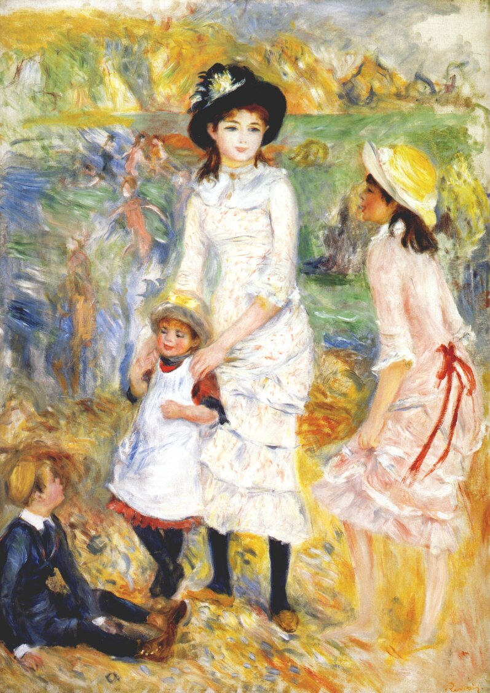

# Children (Sunday 17th June)

And then there was the last day of my first stay in Brighton, Father’s Day. Low tide is at 13:50 which means to have any chance of leaving the marina, Jessica, Maxime and Samuel have to make it to the marina car park from London by 11am, as Kite, because of her draught, is stuck in Brighton Marina two hours either side of low tide. Jessica, one of the most experienced of my sailor children, knows that you can’t argue or plead with tides or at least if you try, nothing good will come of it, so they make it just before the 11am deadline and we make it out of the harbour with 5 minutes to spare at 11:45.

Sometimes I’m completely in awe of my children, how they have grown, how they interact with each other, how the love shines through the banter. As I have got to know myself more, I have learned that I don’t really like groups of people. House parties are generally not for me. Large venues, festivals and club nights are ok as I can usually find somewhere or some way to hide, often on a dance-floor, but as far as small groups go, I have realised that I find anything more than one other person difficult to deal with. My children when they are all together are the exception to this rule. They seem truly a family and, when I am with them, I feel more part of a family than I have ever done.

My daughter Tegan, who lives in Glasgow, had flown down on Friday evening. The two of us spent Saturday messing around with Kite’s tender in the marina and shopping for everyone’s arrival on the Sunday before heading into the centre of Brighton in the evening to eat at Food for Friends, one of my favourite vegetarian restaurants.

I have to admit to a certain amount of stress on the Sunday morning but that disappears as we leave the marina behind. There is little wind so we motor most of the way to Seaford, in the east, where we anchor. Tegan makes lunch. Jessica helms. We eat in the sunshine. Once anchored, with the bathing platform on the back of the boat down, I’m transported back 20 years to when they were little as we all take it in turn to jump into the water and swim around. A party sets out to swim ashore and buy ice creams. I watch from the boat as they discover, looking ruefully at the distance to the snack vendor, how stony the beach is. Maxime and Samuel share the helming on the way back and before we know it, we are safely tied up in Brighton again.

Though I’m concerned for Jessica, who is the driver for the journey back to London, I am also really pleased when we all decide to eat dinner at Cafe Rouge in the marina. Though it’s a chain, it still brings back memories of eating in French restaurants as we travelled to and from family holiday destinations in France. These trigger further memories of me as a child, eating out with my own parents on French camping holidays. I ponder that remarkable fixed point in our world so filled with change. All too soon, it is time for them to leave, and after a family photo looking over the marina for me to keep on my boat, Tegan and I walk the others to the car park and wave goodbye. Who knows when I will see them all together again.

Tegan has an early flight back to Glasgow from Gatwick for work on Monday which means getting even earlier buses and trains, so we set alarms and head to bed. In the morning I walk her to the stop and before you know it she is on the bus. I head back up the steps to the marina, look back and see the bus passing. I wave, but her face is buried in her phone. I think that is as it should be, there is so much more in this world than her silly old dad. As I turn and walk back towards Kite, my phone makes the sound for a new message, a message from Tegan.
