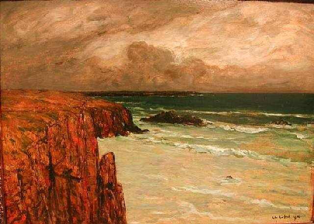

# Falmouth to Brest Part 2 (Monday 31st July 2017)

I wake at around 2am, climb out of bed and get on some warm clothes. Once up on deck, I learn that Max has seen her first dolphins, whom she has named named Dave and Doris, Dave being more friendly and Doris apparently a bit standoffish. I settle down for my watch as Max heads down to take her turn sleeping.

I love this watch. There is something magical about seeing the sunrise at sea. My first hint of land comes when I start to see regular light patterns in the sky. These are shipping lights from the Ile d’Ouessant and the set of island and rocks between it and the French mainland. We have chosen to stay out to sea, well west of the whole lot. I will cost us a few hours. Rather that though, then the quicker rockier passage in the dark. As dawn breaks and the rocks in the distance emerge from the dark, I’m glad we made this call. My watch passes quickly and soon Max comes up to take over and I head down for another sleep.

By the time I wake again at around 10 am it is warm and sunny and there is no need for warmer clothes. We are round the islands and rocks now so we change course to a more comfortable broad reach and head for the the Goulet de Brest. With the wind behind us we fly along and our spirits soar. We play tunes loudly and practice yoga on the boat, clipped on with life jackets of course. Max even finds time to sunbathe at the prow of the boat.

We take the decision to take the main down before we enter the harbour. This time we get it wrong as there would have been plenty of room to drop the sail closer to the marina and it could have saved us some time getting into the harbour. In good winds Kite sails faster than she motors. Oh well!

On arrival at the marina we find our allotted berth. As I motor past I reflect that it will be a tight squeeze. I put Kite in reverse and motor backwards. We moor without hitting anything, which I’m pretty proud of as there is only about 30 cm between us and the boat next door. Tied up, we open some prosecco and celebrate completing the first leg of our journey together. We toast that no one died and we didn’t hit anything.
