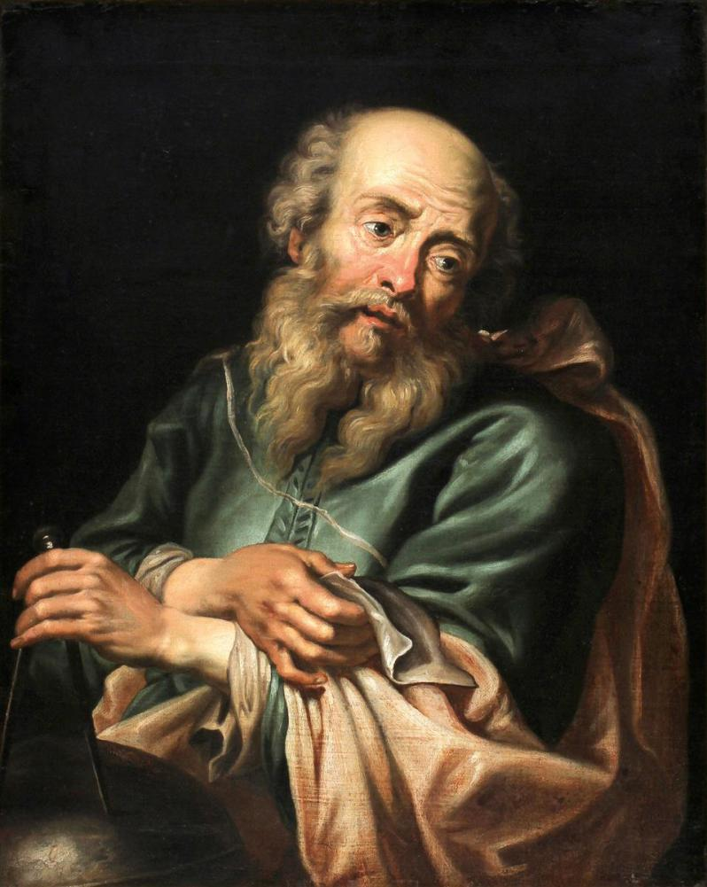
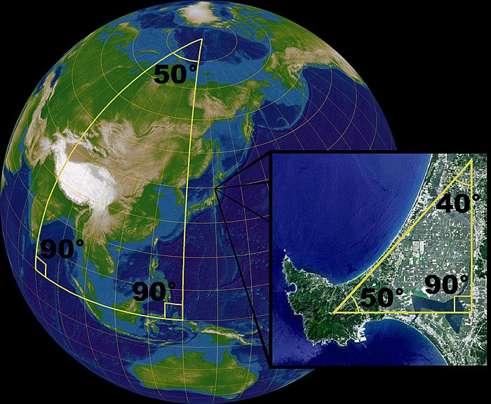
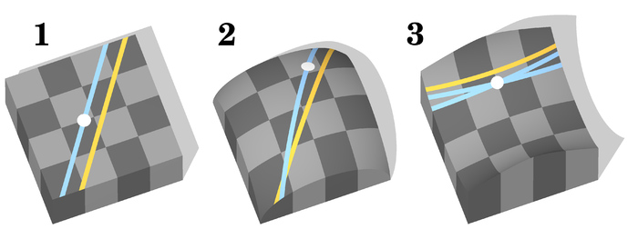
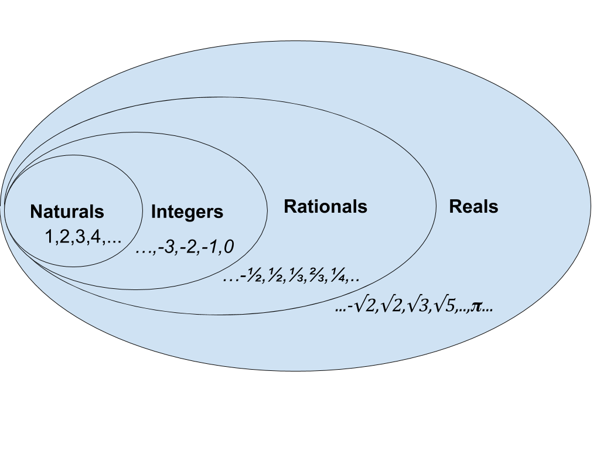
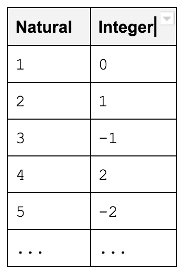
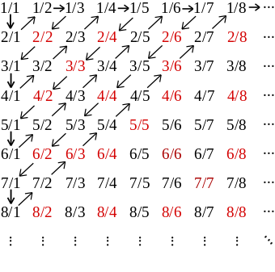
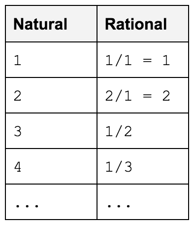
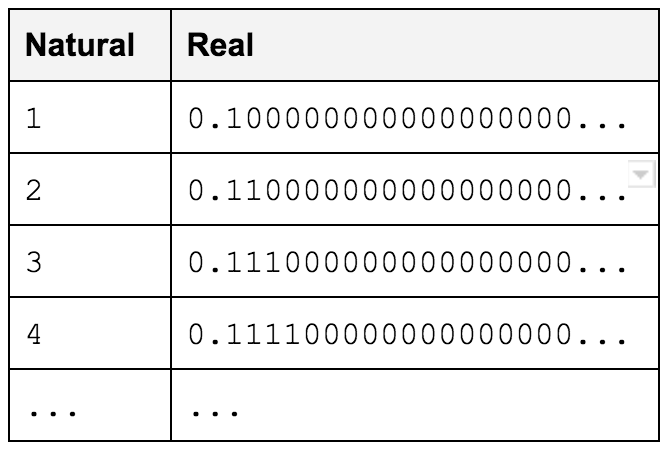
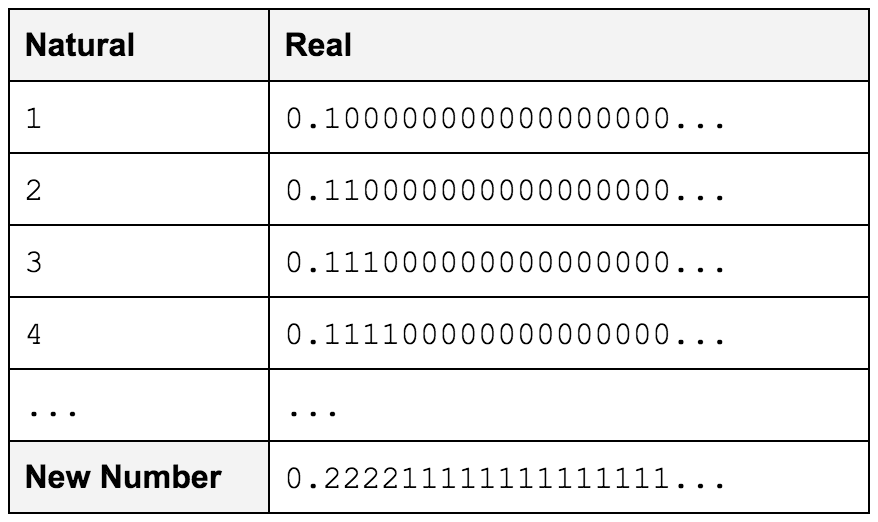

# The Limits of Reason (Sunday 6th August 2017)

At 2 am I wake to take over from Maxime who is apologetic that she hasn’t followed her skipper’s instructions around the use of the electronic wind vane steering. This is a mode of the autopilot that keeps the boat on a set course in relation to the wind rather than the compass. She is worried that we are off course, but I explain that that is not a problem. I get her to help me jybe before she goes down for her sleep.

I make myself comfortable on the doggy step and remember my missing proof from the night before. I doubt I will think of all of it in a single watch. Tonight I will focus on reason and mathematics.

I suppose my story starts with [Euclid](https://en.wikipedia.org/wiki/Euclid) and that cussed geometry. In [The Elements](https://en.wikipedia.org/wiki/Euclid%27s_Elements), Euclid sets out a number of rules or axioms (he called them definitions, common notions and postulates). All but one of these rules are very simple and self evident. The fifth or [parallel postulate](https://en.wikipedia.org/wiki/Parallel_postulate) is not. It essentially states that two parallel lines will never meet.

 

 

This postulate was so different (see the list above), that for two millennia mathematicians tried to prove that it could be derived from the other rules. This, however, seemed a small and insignificant mathematical problem. So that in the 16th century [Galileo Galilei](https://en.wikipedia.org/wiki/Galileo_Galilei) felt that:

> *“Mathematics is the language in which God has written the universe.”*

and by the 19th century [Carl Friedrich Gauss](https://en.wikipedia.org/wiki/Carl_Friedrich_Gauss), the leading mathematician of the times, was happy to exclaim that:

> *“Mathematics is the queen of the sciences….”*

Yet as the 19th century drew on, events would happen that would ultimately challenge this view. Mathematicians [Janos Bolyai](https://en.wikipedia.org/wiki/J%C3%A1nos_Bolyai) and [Nikolai Lobachevsky](https://en.wikipedia.org/wiki/Nikolai_Lobachevsky) would develop hyperbolic-geometry and [Bernhard Riemann](https://en.wikipedia.org/wiki/Bernhard_Riemann), [elliptical geometry](https://en.wikipedia.org/wiki/Elliptic_geometry), both of these systems would deny the parallel postulate and later become known as [Non-Euclidean geometries](https://en.wikipedia.org/wiki/Non-Euclidean_geometry).

Riemann’s spherical geometry, a special case of elliptical geometry, can be seen as a model of our own planet, lines of longitude that are parallel at the equator meet at the poles and the angles of larger triangles do not add up to 180 degrees.

 

As I stare down into the cabin from the doggie step and see our chart table, I muse that sailors could probably have told mathematicians all this, for on our charts we have always measured distance, using those iconic dividers, from the latitude scale on the side of charts, where one minute (a 60th of a degree) is always equal to one nautical mile. We never use the longitude scale at the bottom of charts, as the minutes get smaller the further north you go from the equator and disappear into nothing at the poles.

The advent of these new geometries raised concerns and led mathematicians to seek two properties for any sets of rules:

* **Consistency** – If we reason from the rules, can we be sure that we can avoid a contradiction.
* **Completeness** – Do the rules uniquely describe a situation so that any statement can be proven to be either true or false.

Consistency is vital, because, in a logical system, once one can prove a contradiction one can prove anything, and therefore, the rules become useless as description of anything. Euclid’s rules without the parallel postulate, are definitely not complete as they admit different interpretations as illustrated in the diagram below. One cannot prove or disprove that the angles of a triangle always add up to 180 degrees as it is true in 1 but false in 2 & 3.

 

As the earlier statement of Galileo indicates, mathematicians had always assumed the completeness of mathematics, that mathematics was discovering the language of the universe, a view that was to become known as the mathematical philosophy of [Platonism](https://en.wikipedia.org/wiki/Philosophy_of_mathematics#Platonism). With the advent of non-euclidean geometries, the issue of completeness, and even more importantly consistency, began to call Platonism into question.

I am lifted from my mathematical reverie to see that we have some company. I jybe behind a tanker and avoid a fishing vessel. With the wind directly behind us and the waves at around three meters it is hard to hold course without the risk of a crash jybe, where the boat turns away from the wind accidentally and the sail swings from one side of the boat to the other. As I know from bitter experience, the forces involved can be so great, as to rip the boom clean off the mast. So we stay at about 160 degrees to the wind, using controlled jybes, where the sail is winched to the centre before the turn, to zigzag down our course line.  

Sailing excitement over I settle down again on the doggie step. I’m soon in the second half of the 19th century and thinking about mathematician [Georg Cantor](https://en.wikipedia.org/wiki/Georg_Cantor), the inventor of set theory. As part of his work, he provided some major insights into the nature of infinity. To understand the importance of these it’s helpful to define different sets of numbers:

* [**Naturals:**](https://en.wikipedia.org/wiki/Natural_number) 1,2,3,4,5,6,….. – the positive whole numbers. Sometimes this set also includes the number 0 but as we will be counting we will stick to the positive numbers.
* [**Integers:**](https://en.wikipedia.org/wiki/Integer)  …….,-3,-2,-1,0,1,2,3,……… The Natural numbers with zero and the negative whole numbers
* [**Rationals:**](https://en.wikipedia.org/wiki/Rational_number) ….,-1/3,-1/2,-2,-1,0,1,2,1/2,1/3,….. The Integers together with all the positive and negative fractions.  
* [**Reals:**](https://en.wikipedia.org/wiki/Real_number) The Rationals together with all the points on a line that can’t be expressed as fractions otherwise known as irrational numbers, things like pi and the square root of 2. This includes all decimal numbers including the ones that go on for ever.

We can visualise this situation with a picture called a [Venn Diagram](https://en.wikipedia.org/wiki/Venn_diagram):

As part of his work on sets, Cantor demonstrates that, while it is possible to count all the Integers and count all the Rationals, it is not possible to count all the Reals. In order to do this he had to define what it was to count in an infinite sense. The following table illustrates how one might count the integers according to Cantor:

Counting, in the infinite sense Cantor defined as finding a rule, or what mathematicians call a function, that assigns to each natural number an element of the set being counted, so that all elements are assigned to a number. It’s not important, but if you are interested, the function for the above counting is:

    f(1) = 0
    f(n) = n/2 (if n is even)
    f(n) = -(n-1)/2 (if n is odd and greater than 1)

To prove that rational numbers are countable Cantor constructed a table all fractions:

By zigzagging across the table diagonally it is possible to assign each natural number a rational number as illustrated in the following table:

Though some fractions will be counted more than once, all fractions and whole numbers and hence all of the Rationals will be counted.

To prove that you can’t count the Reals, he developed a technique that has become known as [Cantor’s diagonal argument](https://en.wikipedia.org/wiki/Cantor%27s_diagonal_argument). It is a [proof by contradiction](https://en.wikipedia.org/wiki/Proof_by_contradiction).

First assume that we can count all the points on a line say between 0 and 1. Such a count might look like the following table:

Now we try and make a new decimal number that is not part of the count. This we can do this simply by ensuring that for the first number counted our new number is different at the first decimal place, for the second number counted we are different at the second decimal place and so on. Because our new decimal number is different from every number in the count, the count can’t count all the decimal numbers and we have a contradiction.

Since we placed no restriction on the count we chose in the first place (the numbers in the table were just for illustration) there can be no count of all the points on a line between 0 and 1. Since the points on a line between 0 and 1 is a subset of all the real numbers we can’t count the Reals. A startling consequence of this proof is that, in Cantor’s world, there is more than one infinity, in fact for him there are infinite number of infinites called the [Transfinite Numbers](https://en.wikipedia.org/wiki/Transfinite_number).

Cantor’s work provoked enormous controversy. He came under intense criticism especially from the mathematician [Leopold Kronecker](https://en.wikipedia.org/wiki/Leopold_Kronecker) who was to claim:

> *“God made the integers, all else is the work of man”*

Kronecker’s attacks were deeply personal calling Cantor a “scientific charlatan” and a “corrupter of youth”. These criticisms, and others from the likes of [Henri Poincare](https://en.wikipedia.org/wiki/Henri_Poincar%C3%A9), who talked of his work as a “grave disease”, may well have led to the chronic depression that Cantor suffered in later life. This even though [David Hilbert](https://en.wikipedia.org/wiki/David_Hilbert), arguably one of the most influential mathematicians of the times, was to declare:

> *“From this paradise that Cantor with us unfolded, we hold our breath in awe; knowing we shall not be expelled.”*

By the start of the twentieth century, the problems of consistency and completeness of mathematics were coming to the fore. Attempts by [Gottlob Frege](https://en.wikipedia.org/wiki/Gottlob_Frege) to provide a formal foundation for mathematics using logic and set theory would be shown to be inconsistent [when Bertrand Russell found a paradox](https://en.wikipedia.org/wiki/Russell%27s_paradox) At the dawn of the 20th century Hilbert posed [twenty three unsolved problems](https://en.wikipedia.org/wiki/Hilbert%27s_problems) at the [International Congress of Mathematicians](https://en.wikipedia.org/wiki/International_Congress_of_Mathematicians) in Paris. The second of these was:

> *Prove the axioms of arithmetic are consistent.*

As the new century drew on things were looking up. In the 1920’s [Ernst Zermelo and Abraham Fraenkel developed a version of axiomatic set theory](https://en.wikipedia.org/wiki/Zermelo%E2%80%93Fraenkel_set_theory) which eliminated Russell’s Paradox, formalised the work of Cantor and is still the most common foundation used by mathematicians to this day. However, a decade later, [Kurt Godel](https://en.wikipedia.org/wiki/Kurt_G%C3%B6del), in his [Second Incompleteness Theorem](http://mathworld.wolfram.com/GoedelsSecondIncompletenessTheorem.html), building on Cantor’s techniques, was to demonstrate:

> *No consistent axiomatic system which includes arithmetic can prove its own consistency.*

Since Zermelo-Fraenkel set theory includes arithmetic, this means that the very foundations of mathematics, as used by most mathematicians, cannot prove its own consistency. There are many ways to interpret this result, but for me, it puts pay to the idea that the universe is written in the language of mathematics. Instead mathematics, all of it, including Kronecker’s integers, are a human construct, they are stories.

As Max wakes to take her watch, I remember a quote from [Reuben Hersh](https://en.wikipedia.org/wiki/Reuben_Hersh), [who observes](https://books.google.pt/books?id=R-qgdx2A5b0C&pg=PA39&lpg=PA39&dq=Mathematicians+are+platonists+on+the+weekdays+and+formalists+on+sundays&source=bl&ots=NlrVRHvx5t&sig=R-jlRKAIQ2RFuHfbxXKbS5lIFkk&hl=en&sa=X&ved=0ahUKEwiTg_SS7eHVAhVCLcAKHc4gD0MQ6AEIKjAB#v=onepage&q=Mathematicians%20are%20platonists%20on%20the%20weekdays%20and%20formalists%20on%20sundays&f=false), that many a mathematician:

> *"...is a Platonist on weekdays, a formalist on weekends. On weekdays, when doing mathematics, he’s a Platonist, convinced he is dealing with an objective reality whose properties he’s trying to determine. On weekends, if challenged to give a philosophical account of this reality, it’s easier to pretend he doesn’t believe in it. He plays formalist and pretends mathematics is a meaningless game."*

I don’t go to bed straight away, instead I doze in the cockpit ready to help Max with the next jybe. As I do, I reflect on the Hersh quote and think how different I am from one of those mathematicians. The vicious attacks that Cantor suffered can only come about when one is making some claim about absolute truth. I find that his proofs, when looked at as stories, rather than some claim to reality, are truly beautiful. I know when I do maths I am writing a story, creating some fake news as you were In doing so I aspire to the beauty of Cantor’s work. While I think all this, Max manages the jybe all by herself and, exhausted from my reflections, I head down to the cabin for more sleep.

