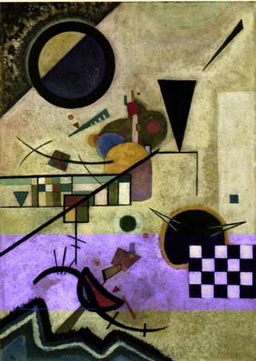

# DJing to Dolphins
Sunday 6th August 2017

Again I wake at 10 to tea and a bacon sandwich, thinking that I could get used to this, and then reflect that I won’t, as that is probably the last of the bacon. Once the breakfast stuff has been cleaned up and I’m in my shorts and suncreamed, discussion turns to what should be our next port, as we are approaching the point where we will need to change course for La Coruna. Our decision will be dependant upon three things:

* The weather predictions.
* How we are each feeling about being at sea.
* The state of the machine screws in the steering gear

The weather indicates that we should be able to get to Bayona but that Porto is probably out. We are both feeling good about pressing on, so it will depend upon the state of the steering gear. Once again we drop the bathing platform and slide the steering gear cover off. Clipped on with my toes dragging in the ocean I examine the screws. Two are firmly fixed and the others are better than the day before, so unless we change our mind later, Bayona it is.

Max heads down for a nap and I fiddle with the sails and the autopilot. The wind has come round so with Kite on the correct heading it is coming across the port side at about 150 degrees. This point of sail, known as a broad reach, with the winds we have, is both fast and comfortable. Once Max comes back up she keeps lookout and I get an opportunity to try out a new equipment configuration.

I bring up my laptop and a small black box which measures about 35 by 15 by 4 cms, I connect the box by usb to the laptop, the boat’s stereo and a pair of headphones. I open Traktor software on the laptop and, with Kite well beyond the sight of land, I have a little mix on my XONE K2. I wouldn’t say that I have had an illustrious dj career, but I have played in many of London’s clubs including Hidden, Jacks, Turnmills, the SE1 Club and the Colosseum, all of which have since closed. Well go on world, I dare you, try and close the Bay of Biscay because the owners of the new flats don’t like the noise.

At around dinner time the wind has come round to the stern of the boat and we are back to zigzagging between jybes. The wind speed is starting to increase as expected. After dinner Max and I chat happily, joking in the evening sun while listening to her tunes. She likes the sailing but is not quite sure about the lack of Gs. I look quizzically and she explains that well there are no 4Gs, no 3Gs no Gs of any kind. I realise that I may have done a cruel thing bringing her out to sea. This is probably the longest she has been without internet since before she was a teenager. Oh well I think, the time I’m spending with her now, listening to her music while she jokes, is blissful for me.

As well as the wind strengthening, the waves are getting bigger, reaching 4 meters at times. Max is not impressed and shelters in the cockpit. I tell her all is fine and that I’ve been on Kite with waves twice as high off Lands End. She is still nonplussed. Then I spy a couple of dolphins and then more and more racing over towards the boat. Before you know it, my daughter has disconnected her phone from the stereo, has it inside a waterproof case on a lanyard around her neck and, clipped on at the prow of the boat, is filming Dave, Doris and their mates. “Play more tunes” she shouts, as we have both become convinced that our visitors like bass sounds. So I find myself djing to dolphins on a Monday evening in the middle of the bay of Biscay. It’s just the sort of crowd, having fun with their boisterous activities, leaping in and out of the water, that will have the local residents complaining to the council.

