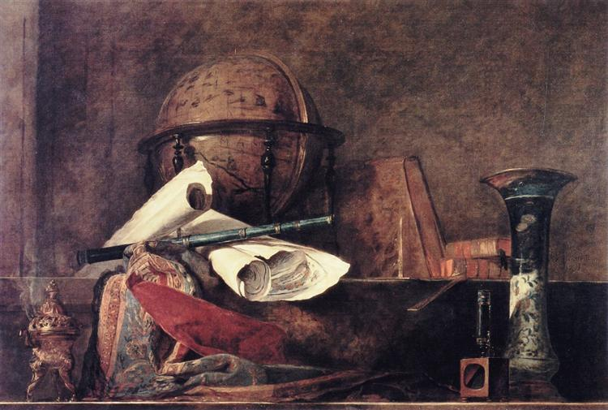

# Science and Certainty 
Monday 7th July 2017

I’ve been asleep for about an hour when I hear the mainsail attempt to crash gybe. We have a preventer line in place to stop this but it’s still not a good thing. We haul the main into the centre of the boat and continue on the motor.  Max is not feeling confident at all, what with the waves this high and the winds this strong in the dark, so I take her watch.

I change course to takes us closer into the Spanish coast where the weather predictions indicate that the winds should be lighter. I’m a bit startled to be awake and suddenly remember that I have the second half of a proof to work through. I think of Max lying asleep below and an incident from her childhood. The day she was given the measles, mumps and rubella vaccination.

Vaccinations have saved countless lives and will continue to do so, but they are based on the notion, to use a phrase from Star Trek, “that the needs of the many outweigh the needs of the few, or the one”. I reckon that it is probably highly unlikely that vaccinations cause harm to a significant number of children, but is also probably highly unlikely that they cause no harm at all. In the UK, as a parent, you are given the choice as to whether to vaccinate your child. You must weigh up the potential harm the vaccine might cause to your child compared with the potential harm that your child might come to unvaccinated, in a community without sufficient levels of vaccination to prevent an epidemic. A successful vaccination program relies on parents not having a fear of the potential side effects of the vaccine.

Within hours of being vaccinated Maxime developed breathing difficulties. These passed, but within a couple of days she had developed a severe case of shingles. Sitting in the doctors surgery while he looked at the blisters that covered most of the right side of her lower torso, we mentioned the breathing difficulties and wondered whether the situation might have anything to do with the MMR. The doctor believed they were totally unrelated. At the time, as now, the UK operated a yellow card system for reporting the side effect to a medicine or vaccine. I asked the doctor if Maxime's reactions should be registered on the yellow card scheme. No he said, they were totally unrelated.

Looking up I can see the clouds being lit by lighthouses on the coast. I spy the lights of, and then confirm on the chart plotter, a vessel fishing in distance. I also see from my phone that for the first time in 2 days we have mobile phone signal. I post a short facebook message to say that we are ok and off the Spanish coast. I head south to dodge the fishing boat and then set the autopilot on a south easterly direction.

Returning to my thoughts, I note that proponents of vaccination would argue that a set of clinical trials of the vaccine have shown it to be safe. Safety is also guaranteed by the yellow card system. The success of both these approaches is based upon their use of something that is often called the scientific method. What I want to think about on this watch is the nature of the scientific method and if it can provide any guarantee of truth.

One of the earliest descriptions of the scientific method can be attributed to [Francis Bacon](https://en.wikipedia.org/wiki/Francis_Bacon), whose ideas can be called [Naive Inductivism](https://en.wikipedia.org/wiki/Inductivism), this postulates that theories about the world are generalised from phenomena using a process called induction. Having see one thousand swans, all of which are white, one might infer, using induction, that:

> *All swans are white.*

Some forms of Inductivism, most notably the [Positivism](https://en.wikipedia.org/wiki/Positivism) of [Auguste Comte](https://en.wikipedia.org/wiki/Auguste_Comte) can be seen as sciences equivalent of Mathematical Platonism in the way they assume the absolute truth of empirically defined knowledge.

Inductivism suffers from a problem called the [Uncertainty of Inductively Defined Truth](https://en.wikipedia.org/wiki/Problem_of_induction), swan one thousand and one may turn out to be black, in which case all that scientific knowledge concerning swans amounts to nothing. Induction is a valuable tool in the scientific process but it doesn’t help one to prove the truth of scientific knowledge.

Seeing these problems the philosopher [Karl Popper](https://en.wikipedia.org/wiki/Karl_Popper) developed the idea of [Falsificationism](https://en.wikipedia.org/wiki/Falsifiability#Falsificationism), where science does not grow but rather evolves. In a falsificationist approach, once the theory that all swans are white is formed, scientists search relentlessly for a counterexample. Having finally reached the southern hemisphere and found a black swan, the first theory is refuted. Almost immediately a new theory is formed:

> *All swans from the northern hemisphere are white.*   

The process of searching for a counter example then begins again. Popper argued that, although scientific knowledge could never be certain, it is possible to move towards more certainty. Falsificationism suffers, as indeed does inductivism, from the problem of the Theory Dependence of Observation. There are a multitude of phenomena that could be taken into account, so in refining the set to look at, scientists often use an existing theory. This is often immensely useful but can also cause problems. Consider the theory:

> *All swans live in the northern hemisphere.*

Since this theory is not the one under observation it could be used to guide the search for phenomena to falsify our original theory reducing effort by half, albeit at the cost of missing the counterexample.

All of this stuff about swans may sound quite artificial until you think back to Maxime’s doctor. He used his knowledge, his medical theory if you will, to determine that Maxime’s breathing problems and consequent shingles had nothing to do with the vaccination. If there were similar instances with other children developing illnesses unrelated to measles, mumps and rubella, perhaps due to an immune system under strain from the vaccination, if their doctors were to make the same decision, using the medical theory that they were all taught at university, that these illnesses were not relevant and should not be entered on the yellow card system, then a potential problem with the vaccination may go unnoticed. On the other hand if doctors are over eager, and record every problem a child has after the vaccination, that might, without further study, lead scientists to conclude falsely that the vaccination is unsafe.

These considerations begin to hint at a further problem with Falsificationism, that, as a theory itself, it does not fit the phenomena of science. Science is a cultural activity, as [Thomas Kuhn](https://en.wikipedia.org/wiki/Thomas_Kuhn) points out in [The Structure of Scientific Revolutions](https://en.wikipedia.org/wiki/The_Structure_of_Scientific_Revolutions). A book in which the author coined the modern use of the word [paradigm](https://en.wikipedia.org/wiki/Paradigm). For Kuhn there are long periods of normal science involving an accumulation of knowledge punctured by short periods of revolutionary science. The [Copernican revolution](https://en.wikipedia.org/wiki/Copernican_Revolution) provides a prime example. Here the paradigm of the discipline of astronomy shifts from an earth centric to a sun centric view. 

It is cloudy, so there is no definable sunrise, but as it gets lighter and I begin to see the land from the port side of the boat I recall my favorite philosopher of science, [Paul Feyerabend](https://en.wikipedia.org/wiki/Paul_Feyerabend), who, rejects[^1] the idea of any universal scientific method [altogether](https://en.wikipedia.org/wiki/Against_Method):

> *“It is clear, then, that the idea of a fixed method, or of a fixed theory or rationality, rests on too naive a view of man and his social surroundings. To those who look at the rich material provided by history, and who are not intent on impoverishing it in order to please their lower instincts, their craving for intellectual security in the form of clarity, precision, “objectivity”, “truth”, it will become clear that there is only one principle that can be defended under all circumstances and in all stages of human development. It is the principle: anything goes”*

Exhausted, I leave off thinking and stare out at the sea. After what may be couple of hours, Maxime wakes and is overjoyed to find that she has access to the internet. Then a little later we are joined by another joyous pod of dolphins, though I think Max still firmly believes that it is Dave and Doris who have followed us all the way. I stare across at Cabo Fisterra, and think with a smile, that this sailing lark does tend to take you to the ends of the earth. Then I recall the year before sitting on that headland with a couple of friends who had just finished the pilgrimage to Santiago de Compostela, watching the boats sail by, having no idea that just over a year later, I would be one of those sailors.

In the daylight, even though the wind and the waves are the same, Max seems to have much more confidence and suggests that I head down for a sleep. She agrees to wake me before our next decision point when we will make the final choice between Bayona and Porto

As I lie in bed I review my thoughts of the last couple of nights. Have I shown that:

Reason and science are just stories, sophisticated stories, but stories nonetheless?

Perhaps I’ve gone part of the way, at least I think I’ve shown that if you attempt to claim that either Mathematics or Science gives you absolute truth then you are on very dodgy ground. As I drift off, I remember again Paul Feyerabend and his [anarchistic view of science](https://en.wikipedia.org/wiki/Epistemological_anarchism) and how important it is for me not to constrain thoughts or ideas. Why, at least for me, all should have the status of stories. Before the oblivion of sleep, a final quote, that I think comes from Paul, crosses my mind :

> *“The best education consists in immunising people against systematic attempts at education.”*

[^1]:This is perhaps at least partly in reaction to Popper's attempts to brand [Psychoanalysis](https://en.wikipedia.org/wiki/Psychoanalysis) as unscientific due to it not being falsifiable.
