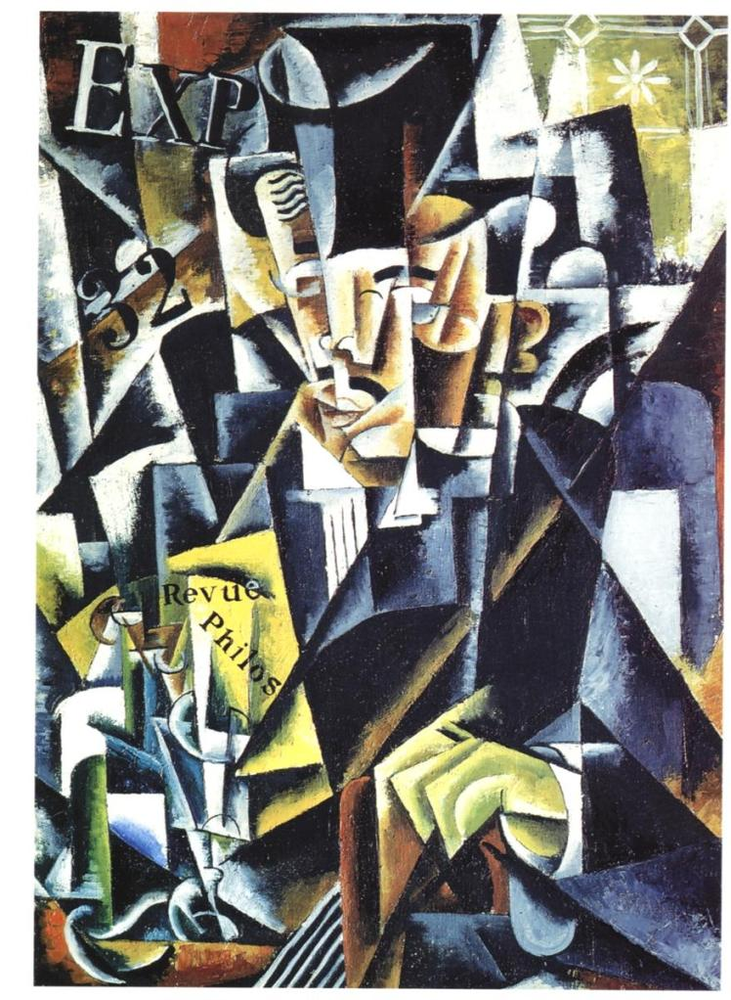

# Giving Up Smoking with Netflix and an Anarchist Philosopher
Saturday 12th to Monday 14th of August 2017

As soon as I get back from saying goodbye to Max at Porto Airport, I climb into bed and, except for getting up to eat or relieve myself, that’s where I stay for the next 40 odd hours, sleeping or watching something on Netflix. I do not, however, smoke.

By Monday the worst of my irritability has passed but I’m still not ready to head out into the world as a non-smoker. As I tire of Netflix, I think of Paul Feyerabend again and how much I enjoyed reading his work 25 years before. Now safely ashore and with the internet to hand, I look him up again and savour some of his more famous quotes:

> *“Today science prevails not because of its comparative merits, but because the show has been rigged in its favour… It reigns supreme because some past successes have led to institutional measures (education; role of experts; role of power groups such as the AMA) that prevent a comeback of the rivals.”* ([Science in a Free Society](https://www.goodreads.com/book/show/1832362.Science_in_a_Free_Society))

Presumably by the rivals he means organised religions, but don’t get the idea that he is a big fan of those:

> *“All religions are good ‘in principle’ – but unfortunately this abstract Good has only rarely prevented their practitioners from behaving like bastards.”* ([Farewell to Reason](https://www.goodreads.com/book/show/147382.Farewell_to_Reason))

He sees science as a belief system of the same order as religion:

> *“The separation of state and church must be complemented by the separation of state and science, that most recent, most aggressive, and most dogmatic religious institution.”* ([Against Method](https://en.wikipedia.org/wiki/Against_Method))

The notion of truth also comes in for a bashing:

> *“Love of Truth is one of the strongest motives for replacing what really happens by a streamlined account or, to express it in a less polite manner — love of truth is one of the strongest motives for deceiving oneself and others.”* (Conquest of Abundance)

What science is all about for Feyerabend, and indeed for me I realise, is not truth but doubt.

I think back on my journey so far and wonder if there is anywhere I have failed to doubt when I should have. Yes there was the time we were fixing the steering where, if I hadn’t been so focussed on getting the task done, I would have remembered about a set of alum keys that I keep with the bike tools that would have saved an hour or two of work.

I smile at the thought and then I gasp as I realise there are another two times I could have doubted myself. At Clacket Lane when I heard the word “Overcrowded” and again in Dartmouth with the phrase “Only Asians buy houses in our area and they won’t pay much.” I made massive assumptions. From a word and a phrase my mental gag reflex, as I called it, presumed that I was dealing with a certain class of person, who is xenophobic, quite possibly racist and almost certainly anti-European. In Feyerabend’s terms I was giving myself “a streamlined account” of a situation and I was quite possibly “deceiving myself and others”. The derogatory labelling of people is exactly what I would accuse the racist of, but here I was doing it myself.

I lie restless for a while tortured by these thoughts. A cigarette seems very tempting indeed. Instead, though, I get out of bed, drink some water and do some deep breathing. As I haven’t done much for two days except lie in bed, getting up occasionally to eat, the main cabin is a state. I start washing up. As I do this I come to realise that while my failure to doubt, my putting people in boxes, is not something to be proud of, my recognition of it is actually positive.  The washing up done I clean the boat and gradually my ability to think seems to fade.

With a tidy cabin and clean dishes I head back to bed. I watch some Netflix for a bit but then turn it off and lie listening to the wind and feeling Kite as she gently rocks on the water. As I drift off I remember one last Feyerabend quote from my day of reading:

> *“We need a dream-world in order to discover the features of the real world we think we inhabit.”* ([Against Method](https://en.wikipedia.org/wiki/Against_Method))
