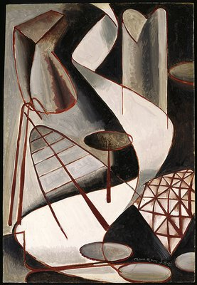

# Giving Up Smoking Constructively 
Tuesday 15th of August 2017

I awake on the Tuesday, still with a lingering nicotine craving and wondering why on this journey, I have started thinking about the philosophies of science and mathematics. It seems a little weird to say the least. If I think of my knowledge as a toolkit of stories, then these thoughts have lain at the bottom of the toolbox for years. They haven’t been used since my days in academia. I crawl out of bed to get some breakfast and go for a shower, but cigarette-less me is still not ready for the world so once back at the boat I put my pyjamas on again and head back to bed.

I lie under the duvet just thinking, examining my metaphorical toolbox of knowledge, looking at what is and what is not useful. I figure that the reason the philosophy stuff stays at the bottom of the box is that I only use it in times of great change in my life, when I need to reorient myself, when I need to reset as it were, and of course that is exactly what I’m doing now as I escape my old life in the United Kingdom.

The philosophy of science, and particularly Feyerabend, has helped me rediscover doubt. This doubt is in the process of sweeping away a lot of old certainties that perhaps have been, like the crusty barnacles on the bottom of a boat, impeding my progress. I now examine the philosophy of mathematics, taking this tool from my toolbox and turning it round in my hand, I realise that I have missed some of its functionality. I have mused on Platonism, that believes that the world is written in the language of mathematics and Formalism, that believes that mathematics is just a game with symbols, but I have, until now, completely ignored a third philosophy of mathematics, [Constructivism](https://en.wikipedia.org/wiki/Constructivism_(mathematics)).

For me Constructivism arises in [Gödel’s first incompleteness theorem](https://en.wikipedia.org/wiki/G%C3%B6del%27s_incompleteness_theorems) which states:

> *No consistent axiomatic system which includes arithmetic is complete, that is, there will exist statements in the system that cannot be proved to be true or false.*  

Classical mathematics, in both its Platonist and Formalist guises, believes in a rule called [the law of the excluded middle](https://en.wikipedia.org/wiki/Law_of_excluded_middle), that is:

> *Any statement is true or it is not true.*

The Constructivist, sensing the inconsistency between Godel’s result and the law of excluded middle, abandons the latter and claims that to prove the existence of mathematical object, that object must be explicitly constructed. Constructive mathematicians are not common, and might be thought of as the vegans of the mathematical world. Most mathematicians believe, perhaps wrongly (see [Bishop’s Constructive Analysis](http://www.springer.com/gp/book/9783642649059)), that to be a Constructivist means giving up on much of mathematics.

There are however many people who would not call themselves mathematicians, who nevertheless practice constructive mathematics, perhaps these days, significantly more than all of the world’s mathematicians put together. This comes about due to something known as the [Curry-Howard Correspondence](https://en.wikipedia.org/wiki/Curry%E2%80%93Howard_correspondence) which states that if logic is thought of in a constructive manner, that is without the law of the excluded middle, then:

> *A mathematical proof is really the same thing as a computer program.*

Therefore all those software developers, reinventing the very fabric of our world with their code based stories, can be thought of as constructive mathematicians.

I recall that the Curry-Howard correspondence is taken further by Swedish mathematician [Per Martin-Löf](https://en.wikipedia.org/wiki/Per_Martin-L%C3%B6f). In his work on [Type Theory](https://en.wikipedia.org/wiki/Intuitionistic_type_theory) he establishes the following correspondences:

* a is a member of the class B
* a is a proof of proposition B
* a is a program that meets the specification B
* a is a solution of problem B

As I think this, lying in my bed, with just the mildest craving for a roll up, all of a sudden it dawns on me that I have a solution to my fake news problem. Or rather; I realise as all news is in some sense fake, I have a way to approach stories that seem to me implausable. There is for me an additional correspondence.

* a is a story with title B
  
When I hear a claim B, that seems implausible to me, I can treat it as the title of a story, I can push further, with genuine interest, I can ask why people believe what they do? I can seek the story, a, that fits the title B. I don’t have to tell them that they are wrong, I don’t have to ignore them, I just have to be curious. If it works well I may get to share some of my stories. I might have a story of why the UK is not overcrowded and another where a small class of people by themselves can’t possibly have an effect on the housing market. We may even get to constructing some new stories that come about from reflecting on our existing tales.

It is such a simple approach, that fits with my desire for politeness in interactions with others, that I can’t believe I haven’t thought of it before. With this notion in my head and not a thought of a cigarette I curl up and fall fast asleep.
