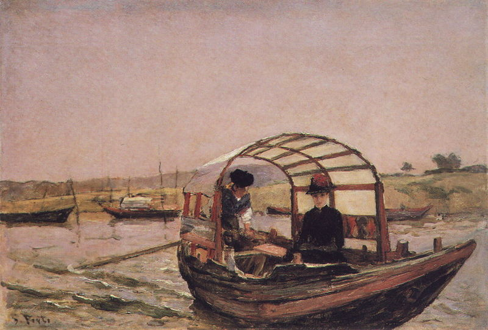

# Porto to Figueira Da Foz 
Sunday 20th August 2017

My alarm goes off at 5:30 am but I set another for 6am. The wine and the food from the night before have had an effect and I don’t feel as sprightly as I’d hoped. In the end I slip my lines and get away at around 7am. While I’m still in the Douro river I get the fenders in and away. The lines I stash under the sprayhood to be dealt with later. For the first time single handed, I head out into the Atlantic.

Once I have made enough distance away from the harbour and have my lines stowed, I turn Kite back the way we have come with her prow directly into the wind ready to raise the mainsail. I glance up at the main halyard, the line that will haul the head (top) of the sail up the mast. Scarcely believing what I see, I look again and confirm that the halyard is caught around the radar reflector and the new steaming light. I must have forgotten to pull the slack back when I attached it to the head of the sail while still in Porto.

I spend thirty minutes trying to flick the halyard off with the boat in all directions to the wind. The line normally runs down the back of the mast but is now caught around the front but then feeds back over the spreader at a height of about 4 meters. My flicking is to no avail. I’m aware that after leaving late and now messing around we’re not making progress, a worry as there is still 11 hours of sailing ahead. I decide to quit my efforts set the boat on course and motor while I think about other approaches to solve the problem.

After about an hour I come up with a plan of sorts. Using the line that I normally use as a preventer I tie a rolling hitch to the main halyard. This knot moves in one direction but holds firm in another. I throw the preventer line over the spreader and use this to flick the halyard off the radar reflector and the steaming light. I quickly get rid of the slack to avoid the halyard catching again.

I throw the preventer line back over the spreader and now I should be able to just pull and the knot should slide down the halyard. I’m not sure why, maybe I didn’t tie the rolling hitch correctly, maybe the lines are too old to slip easily but my plan is not working. I now have a free halyard but with a line tied to it at around 4 meters high. I still can’t raise the mainsail as this knot would get stuck at the top of the mast with the sail about half way up, plus having lines flying about about is generally not a good idea on a boat as I know only too well from the incident with the jib sheet on the way to Dartmouth.

I head back to the cockpit and open the clutch for the main halyard. Back at the mast I pull the halyard down as much as it will go, but the knot that I need to undo is still well over a meter above my head. I climb the mast as much as I safely can but the knot is still agonisingly out of my reach. I need more length on my halyard, so I head back to the cockpit, grab another line from the locker and then fetch my mouse line from the main cabin. I undo the stopper knot that keeps the halyard from getting lost through the clutch and use a nail knot to tie my mouse line to the halyard. I use the same knot on the end of the new line. At the mast again I pull the halyard down and this time I can undo my original knot. I head back to the cockpit pull the halyard back through the clutch, undo the nail knots and re-tie the halyard stopper.

I turn Kite head to wind and get the mainsail raised. I’m soon on course again and we are flying along at 7 knots on a broad reach. I sit back in the cockpit. Sweat is running down my face and my back but I’m happy. As I get my breath back, Doris and Dave and the rest of their dolphin mates come flying over to the boat. I’m not sure whether this is to laugh at my original mistake or congratulate me on the eventual fix, maybe a bit of both. The rest of the day passes in the joy of single handed sailing which is marred only by the site of the smoke from forest fires on the land to my east. I reach Figueira Da Foz at around 8pm and thanks to forgiving Swedes and helpful Fins, I am eventually docked and soon fast asleep.
