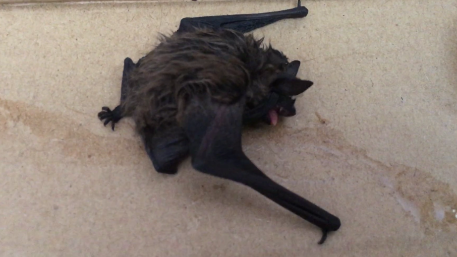

# Bat 
Tuesday 22 August 2017

I wake with cramp, no fun in the limited space of Kite’s aft cabin. Eventually I manage some stretches that allow me to relax. I lie idly in bed for a while and then get up and make some breakfast. At 9 I head down to the marina office to register. When I come back, with the mist of the previous night now almost gone, I see that my boat is a mess. I wash and clean the inside and then get the hose out to top up my water. Once that is done I start to wash down the decks. From inside the playlist selects Glorious (Macklemore feat. Skyler Grey), one of Maximes tune’s. The chorus seems to capture my mood perfectly in the sunshine.

> *I feel glorious, glorious*  
> *Got a chance to start again*  
> *I was born for this, born for this*  
> *It’s who I am, how could I forget?*  
> *I made it through the darkest part of the night*  
> *And now I see the sunrise*  
> *Now I feel glorious, glorio...*  

Ughhhh, my hand drops the piece of gaffer tape that I have just picked up from the deck. It moved! How can gaffer tape move? I bend down to look more closely and realise that it’s not gaffer tape at all. I see a tiny bat; tired, wet and bedraggled, gently crawling across the boat. I have soaked the poor little thing with the hose. It looks exhausted. I head down into the cabin and get a pack of sugar. I spread it out in front of the bat but it shows no interest. I have no idea what to do about this so I for the second time in less than 24 hours I turn to social media. I post up a picture and ask if anyone has advice. The response is staggering. There are links to bat websites and my friend Paul starts up a message with Duncan a bat expert and working together we develop a plan.

The plan involves putting Brucie, as I have called her, into a box to keep her safe during the day and finding a place to release her in the evening. I don gloves to avoid a bite, as she might be carrying rabies, collect her from the boat and get her safe in the box with some water. Other bat experts Tyson and Manuel join the message thread. UK bat experts contact their Portuguese equivalents. A backup plan is developed in case Brucie doesn’t fly. If it proves necessary, Margarida who is in Alentejo, agrees to return to Lisbon for a pick up the following morning.  

I learn that an ideal release will involve finding some space with no streetlights and some tree cover, placing the bat on something warm and lifting her up to the sky.  This should be done at about 20 minutes after sunset. Leaving Brucie in her box inside the boat I head out. First I go to the marina office. They help me identify a place, about 500 odd meters to the north west of the marina, which sounds like the best location for the release. My second problem is to find something warm on which to release her. I head off into Oeiras, in the midday heat of a Portuguese August, to try and buy a hot water bottle. Amazingly I find a pharmacy where, in mixture of broken Portuguese and English, I manage to purchase one. The shop assistant clearly thinks I am mad until I show her a picture of the bat and explain.

After two hours of being out and about, I open the hatch and climb down into Kite’s cabin only to find the box with its lid open and Brucie nowhere to be seen. I post the bad news on the message thread. I look to see if she is anywhere obvious, but to no avail. Duncan points out that bats can hide in the tiniest of spaces. I decide against an extensive search, fearful that too much movement may end up squashing her. I open all Kite’s hatches and pass the afternoon working at my laptop barely moving. I am immersed in whatever I am doing and don’t notice the time passing. At around 20 past eight in the evening I hear a fluttering from the side of the cabin. I look round just in time to catch the bat, echolocation clearly working, as she flies out of the boat’s main hatch and into the twilight.
