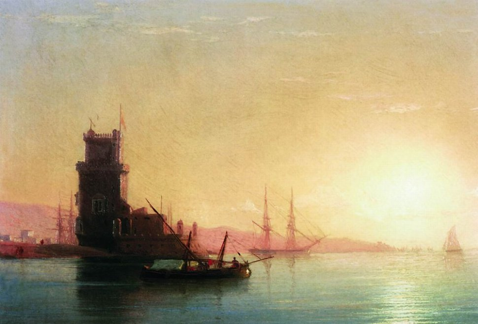

# Oeiras to Lisbon 
Wednesday 23rd August 2017

I think about getting fuel, but I can hear over the radio that there is a queue building up and I really want to catch the tide up the Tejo. I set my lines to slip and start the motor, easing Kite out of her berth and then out of the marina. I get in the fenders and lines in view of the Ponte de 25 de Abril. This visual twin of San Francisco’s Golden Gate Bridge was renamed after the date of the Carnation Revolution in 1974 when the Salazar dictatorship was overthrown and democracy re-established in Portugal.

I turn Kite north into the wind to get the mainsail up. The northerly is a good 15 knots, I point us east and unfurl the jib. With the tide we are soon flying at ten and a half knots. We pass the town of Algés that marks the boundary to Lisbon proper, then quickly the 16th century Torre de Belém and the Padrão dos Descobrimentos, the 1960s monument to Portugal’s Age of Discovery. At this speed it’s not long before we reach the bridge. I get to glimpse up at the statue of Christ the King on my right before looking straight up. I know we have 50 meters of clearance above us but there is something disconcerting about taking a yacht under a bridge.

As we clear the bridge I glance down to the supports and notice that they are decorated with images of dolphins. To my left, I see the smaller multicoloured female statue that faces off to Christ from the top of off the LX Factory. Here, in the Rio Maravilha rooftop bar I will drink Caipirinhas as the sun sets over Lisbon. It is also in the LX Factory that my future classmate Dane will be invited up by the band to play the drums in a truly magical moment that Judy and I won’t quite believe.  Further ahead on the left and high up is the Barrio Alto, and down low, behind Cais do Sodre, is Pink Street. Places where I will drink and dance with newfound friends.

Kite races past the glorious Praça do Comércio, where I will be mostly seen cursing as I cycle on the uncomfortable cobbled road that connects the two coastal cycle path. Behind the cruise ships, Castelo de San Jorge rises above Alfama. Then just after, I spy the prestigious Lux nightclub where I will rediscover the dancer in me after a memorable evening sail back down the river. The riverfront then turns into industrial port until Braco de Prata where, the day after I dance in Lux, Herve, Stéphane and I will build a living room on the Banks of the Tejo.

Then, in no time at all, I’m opposite my new home - Marina Parque das Nações. As I drop my mainsail and get my fenders and and dock lines attached, I’m joined by João in a rib. He guides me in through the sluice gates to my berth on B pontoon. Antonio and Luís are waiting to help me tie up. I visit the Marina reception to register in my new home.

Back on Kite I sort out a few things down below, then reach into the fridge and pull out a bottle of sparkling wine. I pour myself some and pose for a selfie to post up on social media. In my heart I know that I am raising a glass to all the people that helped me to undertake this voyage. I share the bubbles and celebration with my neighbours Serge and Rachel. When the wine is finished and they are gone I switch off Kite's instruments noting from the log that Kite and I have travelled over two thousand five hundred nautical miles together, equivalent to more than a tenth of the way round the world.
