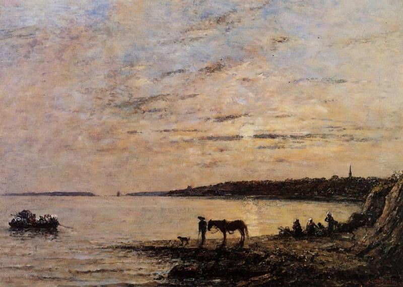

# Leaving Brest (Friday 4th August 2017) #

We leave our Berth at around 9am and head over to the refuelling station to fill up before heading out. With that soon done we head out of the marina, but something doesn’t feel quite right with the steering and I remember I haven’t looked at the machine screws. It must have got left off a to do list when I was copying lists from one rainy day to another. I see an empty place on a pontoon on the outer edge of the marina and we tie Kite up to have a look.

It is not good. Only one one machine screw is tight. Two are about a centimeter out and one has worked itself almost all the way loose and has stated carving small bits of swarf out of the aluminium steering gear and become bent in the process. Well I have the new alum head machine screws from Hanse, that are proper size replacements, so I’m confident we can fix this, it’s just a question of how long it will take. The answer is a couple of hours. The bent screw is a pig to remove, requiring us to take apart much more of the steering gear than I would like. However in the end, the new machine screws are tightly in, the steering gear reassembled, the electronic  rudder feedback mechanism re-calibrated and we are ready to go again.

We set off into the bay and set Kite head to wind to get the mainsail up. This is not as easy as it should be as we have made a couple of silly mistakes rerunning the reefing lines. The sail has to go partially up and down again while we fix this. Eventually with the main up we are on our way. The wind is almost dead against us so we are motoring. We take care to avoid a cargo vessel being manoeuvred by two tugs. When we are clear I’m standing in the centre of the boat by the spray hood when Kite’s mainsail bag tousles my hair as if showing that she’s pleased we are on our way again. I’m reminded of a quote I saw on a sailing website:

>*“You know what the first rule of sailing is? ….Love. You can learn all the math in the ‘verse, but you take a boat to sea you don’t love, she’ll shake you off just as sure as the turning of the worlds. Love keeps her going when she ought to fall down, tells you she’s hurtin ‘fore she keens. Makes her a home”* – Cpt. Mal Reynolds, Serenity (edited)

We motor and sail and motor and sail to avoid the rocks at the Chaussee de Sein. At about 5:30 Max cooks a delicious meal by frying some merguez and adding them to heated up stewed vegetables cooked the day before. Served in mugs in the cockpit, it is delicious and warming, just what the doctored ordered. As we head into the evening on our first day, we pass our last hazard, kill the motor and set the sails and the autopilot. Max rests on the deck in the last of the sun. It gets colder and she heads inside to rest before taking first watch.

Kite has a doggie step. The first owner had this made after one of his jack russells broke their leg down the side of the washboards. Though I have no dogs, I have kept the doggie step as it makes a comfortable seat at the entrance to the main cabin. You can see what lies ahead through the spray hood and with the plotter swiveled round, look back briefly to check on Kite’s position electronically. I also find pulling the top hatch forward not only helps keep me warm but also provides a desk that I can use to work on my blog while taking watch.

At 9 Max comes up from resting to stand her first 4 hours. As I head down to sleep I hear her calling for Dave. I have just snuggled into bed when the cry goes up “Dolphins! Dolphins!”. I rush back out in the dark I can just make out the shape of one of those majestic mammals breaking the surface of the water. “It’s Dave!” Max cries, as she tries to get some digital proof on her phone.
