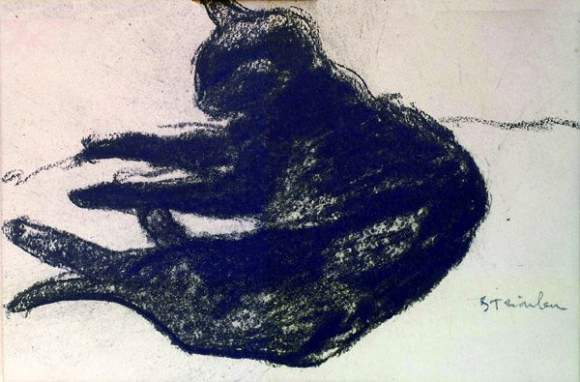

# Ghosts (Monday 17th – Friday 21st July 2017) #

Late on Monday I take Murphy the dog for a walk in London Fields one last time. I sit with him for a while on a stone, by a copse, opposite The Pub On The Park. I walk back alone. I know that by the time I reach my front door he will be in the pub, looking as cute as ever, snaffling discarded crisps. At least I know where I can find him.

Tuesday evening I close the front door and walk up the steps. I take one long look at the park. Then turn and walk away. Mum and Dad are in the car waiting. They drive with me to Brighton. I’m so pleased that they could spend a last few days with me on the boat. They join me for the passage from Brighton to Dartmouth. At longitude one degree fifty four minutes west, opposite the mouth of Branksome Chine, where they were once so happy together, they slip into the water. It will take them a long time to swim to the shore but I know they will thrive in these surroundings.

In a few days I have said goodbye to three ghosts. One spirit, however, will stay with me. I’m afraid, Polly the cat, that I can’t let you go just yet; for I will need you, my mowser, to calm the great storm cats. You will not do this by singing like the [The Mousehole Cat](https://en.wikipedia.org/wiki/The_Mousehole_Cat), rather you will sneak onto their laps when they are not looking. Before they know it, they will be calmly stroking you. Their winds abated, they will look down at you and wonder how you got there.
