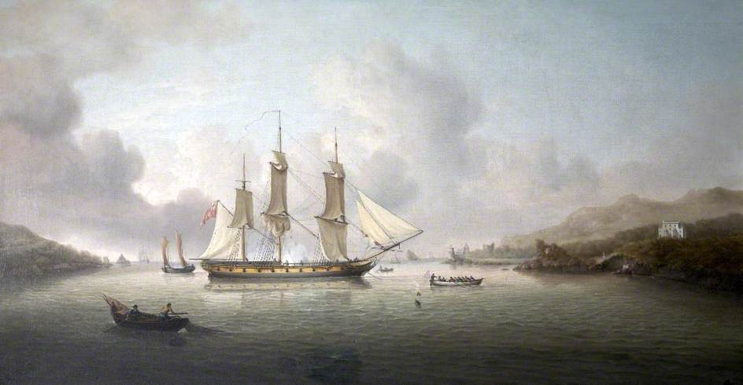

# Dartmouth to Falmouth (Tuesday 25th July 2017) #

I wake at 5am to a glorious blue sky. I know it won’t stay like this, but it’s a good start. I eat some porridge and drink some tea. I shower and shave quickly, then prepare the boat for today’s voyage.

At 6:45 I set the mid and aft dock lines to slip and tidy away the other lines. As Kite is tied up on her starboard side, I engage the engine in forward and turn the wheel hard to starboard. Locking the wheel holds the boat against the pontoon using just the aft line. I head forward and remove the mid line. Back at the helm I turn the wheel to port which kicks the bow out, pointing her upstream. I slip the engine into neutral just long enough for me to remove the aft line, then ease her forward and we are away. I head upstream until it is safe to turn. That was textbook. It’s a shame there was no one there to see it.

I head down the river Dart taking care to avoid both the higher and lower ferries. Catching Kite’s keel on one of their cables would not be good. These two major obstacles passed, I follow the channel out to sea. A safe distance from the mouth of the river I point Kite head to wind and raise the main. There won’t be much chance to sail today as the wind will be against me nearly all the way. Having the sail up adds stability though. I put some drum and bass on and turn up the outside speakers. I’m joined almost immediately by a pod of dolphins. I can think of no better place to be than in the early morning sunshine, tunes blaring with dolphins dancing behind the boat.

It is a day of contemplation and wildlife. I see little in the way of other humans, just two trawlers, which I dodge carefully and two sailboats; one heading in the opposite direction and one that overtakes. I marvel at seabirds, both Fulmars and what I think must be Shearwaters of some kind. Both species fly close to the waves dodging and diving away from the crests. At one point a larger Fulmar is followed by a single Shearwater as if they are conducting an aerobatic display.

The air pressure drops, clouds gradually close in and the water develops a bit of a chop. The wind has been on the nose for most of the afternoon, so the sail hasn’t been providing propulsion. At around 7pm I’m nearing Falmouth, unsure what awaits in the harbour, I turn head to wind and drop the main. I get as many fenders ready as possible. This proves to be the right decision as there are quite a few boats sailing inside the harbour mouth. I head up the Penyrn River to Falmouth Marina. I spot my berth. There is not much room. Even though I’m tired after more than 12 hours of sailing, I manoeuvre Kite in without incident, grateful indeed that I have a boat that reverses well.
