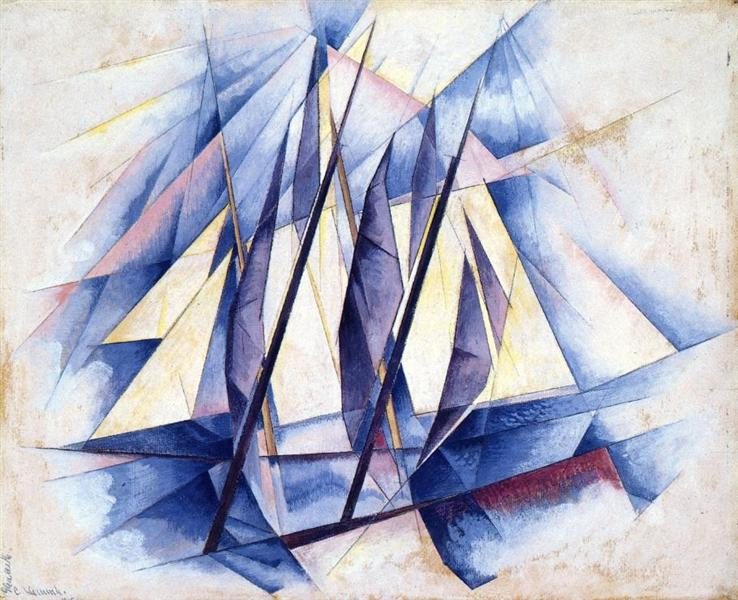

# Brest (Tuesday 1st August to Thursday 3rd August) #

We wake up on Tuesday and check the weather. It looks like we will have at least three days in Brest. While today will be fine, tomorrow will be awful and Thursday not much better. Friday looks like the first possible window to get down to La Coruna in Spain. With this in mind we set out to change the sails today, as this has to be done in the dry, so that the old sails are put away without any moisture.

When I bought Kite she had two sets of sails, the fancy pair that were on her, which I think are made of Kevlar and the standard pair that she came with made from Dacron. The Kevlar sails are lighter and give better performance in slight winds. I had replaced them with the Dacron so that they could go to a sail loft for a service. Until now I hadn’t had a chance to swap back.

Although it is dry, it is still quite windy, so we develop a plan to fold the removed sails slowly as we go. A main sail is not just a simple piece of material. It contains batons for better aerodynamics, reefing points so that sail area can be easily reduced in high winds and cars so that it can be easily run up the mast. As we go the batons must be removed, the reefing points cleared of the reefing lines and the cars slowly removed from the mast. All in all changing the main sail takes till mid afternoon and we still have to change the jib.

The wind has come up even more, which makes the folding of the old jib, as we take it down, difficult. The guy from the neighbouring berth, who has only just arrived back from a sail, and who I haven’t met, sees our problem and hops onto Kite and helps with the folding. A job that could have taken an hour is over in minutes. In response to his efforts we offer him a glass of prosecco, but he declines. In trying to get the new jib on the wind picks up even more. Once again our neighbour is there to lend a hand, and again we are soon done. This time we are more insistent with the prosecco and ask if his wife would like some. She says yes and and we open a bottle and celebrate the day’s work with them.

Alain and Isabelle have lived in Brest for years and give us load of interesting facts like, for example, it’s the coldest place in France in the summer, of which the next couple of days are to provide ample evidence. It’s not long, as I am to find in many conversations with European sailors, before the topic of Brexit comes around. Is the situation not crazy they ask. I concur and point out it’s one of the main reasons behind my journey. We are joined by their friend Bruno. We learn that he has made the passage down to La Coruna. He warns that it may be an idea to go on if the weather permits as it is possible to get stuck in that north western Spanish port by the weather.

Wednesday is as awful as promised with high winds and driving rain at the stern of the boat so that there is nowhere dry to shelter outside. Eventually around 4pm the rain stops and Max and I head out to stock up on food for the journey to Spain and Portugal. We get the bus from the marina to the tram line that will take us to the hypermarket. I often worry that my own behaviour has led my children to drink more than they should, I’m not the only one to blame though. My late father should share some responsibility. It’s rare, when outside the UK, that a younger member of the family can pass an Irish bar without the question “A Guinness for Ray?” being voiced.

Having got off the bus, we search for the tram stop only to pass an Irish bar. Max true to form asks the question. I protest that we have to do the shopping but am soon persuaded that we have plenty of time. It is actually Murphys rather than Guinness but Ray wouldn’t mind. Refreshed we head off to the hypermarket but only just make it out with all our stuff before closing time.

Thursday consists of a visit to Brest for last minute things, meal preparation for en route and plotting our course south. My normal approach is to plot everything on paper charts first, then transfer this information to two separate electronic chart plotters, Kite’s main Simrad plotter and the Navionics app that runs on a tablet. This tends to iron out any problems with the numbers. En route, primary navigation is done on the Simrad plotter, with Navionics running as a back up. The paper charts are tied to the main table and marked with position and air pressure at regular intervals. Heeding Bruno’s advice from a couple of days before, Max and I agree to plot a main course to Porto with options to run to La Coruna and Bayona in Spain if the weather worsens on the way. Before we know it the day is over and there is one more sleep before the Bay of Biscay and the Atlantic Ocean.
