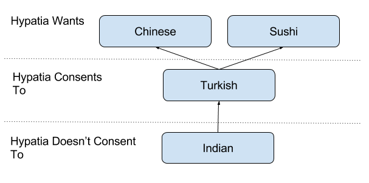
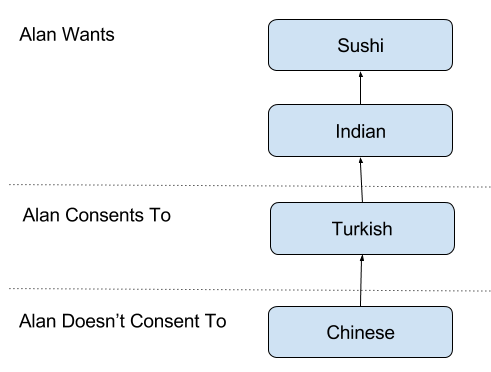
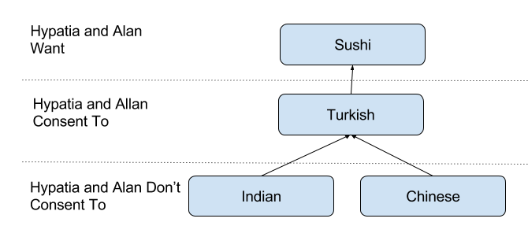

# Figueira da Foz to Peniche, A Mathematics of Consent (Monday 21st August 2017) #

I leave Figueira da Foz at dawn, with the sun rising over the eastern end of the marina., feeling more comfortable single handing, especially as I haven’t made any mistakes, I fall into a reverie, and as is so often the case in these situations, my thoughts are about mathematics. I reflect on an idea I have been working on, an idea that I have taken to calling: A Mathematics of Consent. This uses a graphical approach to expressing what an individual:

* Wants
* Consents To
* Doesn’t Consent To

For example imagine two people, let’s call them [Hypatia](https://en.wikipedia.org/wiki/Hypatia) and [Alan](https://en.wikipedia.org/wiki/Alan_Turing), were discussing where to go out for dinner tonight. Hypatia might have the following preferences:

 

In other words Hypatia wants to eat Chinese and Sushi and but has no preference between the two. Hypatia also prefers Chinese and Sushi to Turkish to which she only consents. Hypatia prefers Turkish to Indian, which she doesn’t consent to at all.

We can see a similar set of preferences for Alan:

 

In other words Alan wants to eat Sushi and Indian and he would prefer Sushi to Indian. Alan prefers Indian to Turkish and that he only consents to Turkish. Alan prefers Turkish to Chinese to which he doesn’t consent.

Now imagine the following conversation:

> Alan: *Fancy going out for dinner tonight?*

> Hypatia: *Sure. Chinese?*

> Alan: *No. What about Indian?*

> Hypatia: *Oh no!* (remembering that she has been for Turkish with Alan) *How about Turkish?*

> Alan: *Turkish it is then.*

I guess that, even in simple situations like going out for dinner, most people have had conversations like this, where in trying to please the other person we have come up with a sub-optimal compromise. A Mathematics of Consent is a tool for avoiding such compromises. It allows us to add, or more accurately intersect, two or more people’s desires to come up with their joint desires. In this case the following diagram:

 

Illustrating that although both Hypatia and Alan consent to going for Turkish, Sushi was a better outcome as it was something they both wanted.

The above example is relatively simple. When looking at preferences of multiple people, expressed in many graphs, with dependencies between the graphs, constructing this picture is not so easy. However, even at this stage a simple theorem starts to emerge:

> **The Say What You Want Theorem:** *When engaging in a conversation about options for the future, always state your preferred options first, otherwise you may end up with a solution that could be been improved upon.*

I look up from my thoughts and check the time. It’s mid morning I should really ring the marina at Peniche to book a berth for the night. It takes a few attempts to get through and, once I do, the news is not good. The marina are not sure that there will be availability and suggest I ring back about 2 in the afternoon. This is worrying but, motoring along, without much to do, except ensure I avoid other shipping, I soon slip back into my reverie.

A Mathematics of Consent is a tool enables individuals to:

* **Define their desires without artificial rankings.** The very act of expressing desires in this way has  provided me with surprising clarity about what I actually do want and also where my boundaries lie.
* **Combine desires to see options for collaboration,** whether that is what food to eat tonight or discussing how to proceed with a relationship into the distant future.

I sit here now staring out at the Atlantic and wonder how this sort of thinking could also be used for bringing together people with widely differing viewpoints. Could the diagrams be applied to Brexit to address the more subtle nuances of people’s concerns. Could one use something like this to reverse the apparent polarisation of society, showing new ways forward, enabling commonality while still supporting diverse opinions.

I lay my pen down and smile, thinking that I have a day and a half of solo sailing to explore these options. As I do so my 2pm alarm goes off. I try Peniche Marina again. I get no answer, in fact I get no answer for quite a while, despite frequent trying. At around 4, I get through, only to find that they definitely don’t have a space for Kite. I ring Oeiras, my next port of call, and they are very helpful and give me specific instructions for my scheduled arrival time, which will be between 2 and 3 am the next morning. Well I think today is going to be a long sail but at least I will get a day off tomorrow. I add the Oeiras course to the plotter, when I look up I can see a mist coming down. It comes down quickly, and within no time at all visibility is down to about 50 to 100 meters. I switch off the autopilot and take the helm to increase my concentration.  

This is just as well, as just before 5pm, a fast traveling fishing boat looms out of the mist on my port side. Though I technically have right of way I take avoiding action anyway. In the wheelhouse of the fishing vessel I see one crew member remonstrating with another and their boat slows significantly. As it disappears into the mist I notice that it’s bristling with electronics including radar. We should have seen each other coming.

Visibility has dropped to about 50 meters, there is not even a breeze and the sea is eerily calm. There are moments when the wind picks up slightly, indicated by tiny ripples on the surface of the water. At these points visibility opens up to about 200 meters. I use these short lived periods to make dinner and coffee and put on warmer clothes. I can’t believe I’m in the Atlantic, the water is more like a lake. Even though I now have the autopilot on, I constantly shift position to try and keep up my concentration. Even so I momentarily get distracted by the drips that form on the boat, which has become a massive condensation trap.

I turn to the west and notice the sun has become small and round like a street lamp. This effect is increased as the sun appears to have a clip missing from the bottom. I realise that I’m probably on the very edge of the solar eclipse whose totality can be seen from the United States. Despite the lack of visibility I can’t resist taking a couple of photos. Soon the sun disappears in the mist altogether and, only because it hasn’t got dark, do I know that it hasn’t set. I had hoped that the mist would lift but as night draws closer this begins to look less and less likely.

The dark settles and I put on the navigation lights. With these shining into the mist, visibility disappears almost completely. At most I can see a meter or two away from the boat.  I start to become fearful, but then I remember back to March and bringing Kite down from Glasgow to the South Coast of England ...
