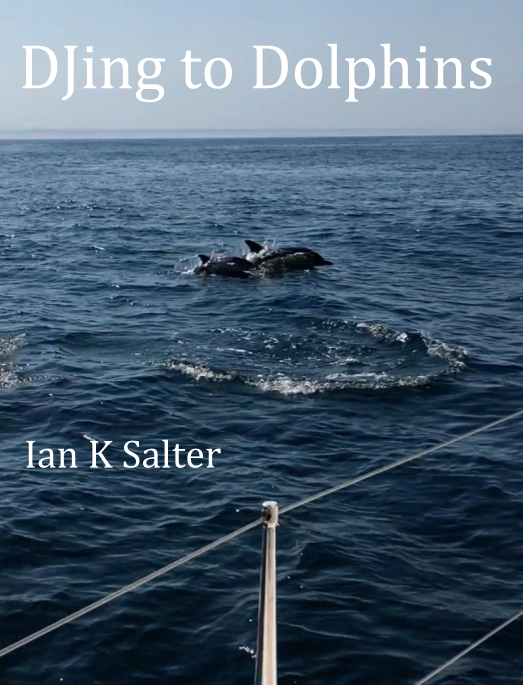

# Frontpiece {-}

The 2017 tales of a sailing voyage away from Brexit Britain.  
  
  

---

To Natalie - for once upon a time on the banks of the Thames, telling me to keep writing.

[Creative Commons Attribution-NonCommercial-ShareAlike 4.0 International License](href=\"http://creativecommons.org/licenses/by-nc-sa/4.0/\").

© Ian K Salter 2017, 2018, 2019

# Preface {-}

This work started life as a series of blog posts written in 2017 when I decided to start journeying. When collecting such work together the question arises as to how much change one should make. I have opted to keep the original works much as they are. I have made only small edits to correct grammar, typos and, occasionally, to improve clarity. 

As far as references are concerned, I could have created footnotes and indexes. Instead, as this edition of these stories is only meant for electronic publication, I have kept all as web links. When reading on phones and tablets the links should work fine. In any case, the source chapters can be easily accesed online at the books git hub repository: [https://github.com/ianksalter/djing_to_dolphins](https://github.com/ianksalter/djing_to_dolphins). A place where the reader may also suggest amendments.

I hope you enjoy these tales.

Ian K Salter (January 2019)

# Acknowledgements {-}

For their love, inspiration and support I thank my children Jessica, Maxime, Tegan and especially Samuel, who was still in the womb when I wrote my last acknowledgment. Thanks also to all the people in my life; the close and not so close. You are too numerous to mention individually, but know that you are an amazing bunch, who constantly surprise and delight me. I owe an enormous debt of gratitude to all the writers, mathematicians, musicians, scientists, painters, film makers, philosophers, sculptors and other artists that have touched my heart. I can only aspire to touching others in the same way. 

At a more practical level I must thank the technologists who made this work possible. The ebook was generated from a git repository of RMarkdown files using R and RStudio. So thanks must go to all the open source developers that made these tools possible. I must also thank the creators of the images in the book many of whom have been kind enough to share their work under a creative commons license. Details of attributions are given at the end of the book. 

Finally I must thank Debbie Atkinson for her editing work. She excels at the standard editor stuff, picking up my frequent misuse of commas and apostrophes and letting me know, that while one's wound might *heal*, a boat always *heels*. More than this, as the person that taught me marine navigation and got me into the whole sailboat with a cabin thing in the first place, she is able to point out that I really mean *north east* when I have written *north west*. I am so grateful for all of it. I hope I get to repay all the favours soon. Needless to say, any errors that remain are entirely down to me.
